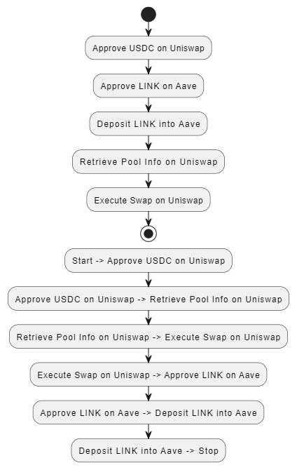

# DeFi Script Overview

## Overview of the Script

This DeFi script is designed to demonstrate the integration of multiple DeFi protocols to enhance financial operations. The script performs a token swap using Uniswap V3 and subsequently interacts with Aave to deposit the swapped tokens and start earning interest. 

### Workflow

1. **Approve USDC on Uniswap**:
   - The script begins by approving the Uniswap V3 Swap Router to spend USDC on behalf of the user. This step is essential to enable the token swap transaction.

2. **Retrieve Pool Information from Uniswap**:
   - It retrieves necessary pool information for the USDC-LINK pair from the Uniswap V3 Factory contract. This includes details about the liquidity pool where the swap will occur.

3. **Execute Token Swap on Uniswap**:
   - The script then executes the swap, converting USDC into LINK tokens using the Uniswap V3 Swap Router.

4. **Approve LINK on Aave**:
   - Following the swap, the LINK tokens are approved for use by Aave, enabling their deposit into the Aave protocol.

5. **Deposit LINK into Aave**:
   - The final step involves depositing the LINK tokens into Aave to earn interest, demonstrating how to leverage multiple DeFi protocols for enhanced financial gains.

## Diagram Illustration

Below is a diagram illustrating the sequence of steps and interactions between the DeFi protocols involved in this script.




```markdown
## Code Explanation

### 1. **Approve Token Function**

```javascript
async function approveToken(tokenAddress, tokenABI, amount, wallet) {
  try {
    const tokenContract = new ethers.Contract(tokenAddress, tokenABI, wallet);
    const approveAmount = ethers.parseUnits(amount.toString(), USDC.decimals);
    const approveTransaction = await tokenContract.approve.populateTransaction(
      SWAP_ROUTER_CONTRACT_ADDRESS,
      approveAmount
    );
    const transactionResponse = await wallet.sendTransaction(
      approveTransaction
    );
    console.log(`-------------------------------`);
    console.log(`Sending Approval Transaction...`);
    console.log(`-------------------------------`);
    console.log(`Transaction Sent: ${transactionResponse.hash}`);
    console.log(`-------------------------------`);
    const receipt = await transactionResponse.wait();
    console.log(
      `Approval Transaction Confirmed! https://sepolia.etherscan.io/tx/${receipt.hash}`
    );
  } catch (error) {
    console.error("An error occurred during token approval:", error);
    throw new Error("Token approval failed");
  }
}
```

**Explanation**: The `approveToken` function authorizes the Uniswap Swap Router to spend a specified amount of USDC on behalf of the user. It creates an `ethers.Contract` instance for the token, constructs an approval transaction, and sends it. This function ensures that the Swap Router has the necessary permissions to execute the token swap.

### 2. **Get Pool Info Function**

```javascript
async function getPoolInfo(factoryContract, tokenIn, tokenOut) {
  const poolAddress = await factoryContract.getPool(
    tokenIn.address,
    tokenOut.address,
    3000
  );
  if (!poolAddress) {
    throw new Error("Failed to get pool address");
  }
  const poolContract = new ethers.Contract(poolAddress, POOL_ABI, provider);
  const [token0, token1, fee] = await Promise.all([
    poolContract.token0(),
    poolContract.token1(),
    poolContract.fee(),
  ]);
  return { poolContract, token0, token1, fee };
}
```

**Explanation**: The `getPoolInfo` function retrieves information about the Uniswap V3 liquidity pool for the given token pair (USDC-LINK). It queries the Factory contract to get the pool address, then fetches details like tokens and fee from the pool contract.

### 3. **Prepare Swap Params Function**

```javascript
async function prepareSwapParams(poolContract, signer, amountIn) {
  return {
    tokenIn: USDC.address,
    tokenOut: LINK.address,
    fee: await poolContract.fee(),
    recipient: signer.address,
    amountIn: amountIn,
    amountOutMinimum: 0,
    sqrtPriceLimitX96: 0,
  };
}
```

**Explanation**: The `prepareSwapParams` function prepares the parameters required for the Uniswap token swap. It constructs a parameters object with the input and output token addresses, pool fee, recipient address, amount to swap, and minimum amount out.

### 4. **Execute Swap Function**

```javascript
async function executeSwap(swapRouter, params, signer) {
  const transaction = await swapRouter.exactInputSingle.populateTransaction(
    params
  );
  const receipt = await signer.sendTransaction(transaction);
  console.log(`-------------------------------`);
  console.log(`Receipt: https://sepolia.etherscan.io/tx/${receipt.hash}`);
  console.log(`-------------------------------`);
}
```

**Explanation**: The `executeSwap` function executes the token swap on Uniswap V3 using the Swap Router. It creates a transaction for the swap and sends it. Upon completion, it logs the transaction receipt.

### 5. **Main Function**

```javascript
async function main(swapAmount) {
  const inputAmount = swapAmount;
  const amountIn = ethers.parseUnits(inputAmount.toString(), USDC.decimals);

  try {
    await approveToken(USDC.address, TOKEN_IN_ABI, inputAmount, signer);
    const { poolContract } = await getPoolInfo(factoryContract, USDC, LINK);
    const params = await prepareSwapParams(poolContract, signer, amountIn);
    const swapRouter = new ethers.Contract(
      SWAP_ROUTER_CONTRACT_ADDRESS,
      SWAP_ROUTER_ABI,
      signer
    );
    await executeSwap(swapRouter, params, signer);
  } catch (error) {
    console.error("An error occurred:", error.message);
  }
}
```

**Explanation**: The `main` function orchestrates the entire process. It converts the swap amount into the correct units, approves the token, retrieves pool information, prepares swap parameters, and executes the swap. It handles errors that might occur during these steps.

## Conclusion

This script showcases how to integrate Uniswap and Aave protocols to perform a token swap and then use the swapped tokens to earn interest. By following this approach, users can leverage DeFi protocols for more advanced financial operations.
```
